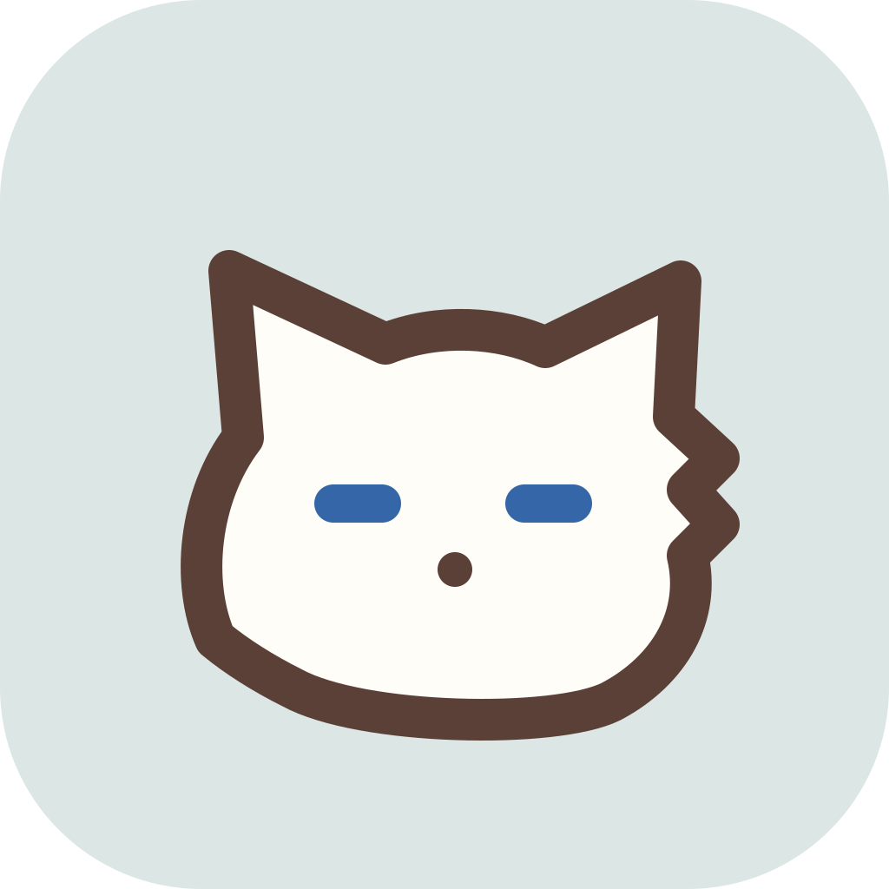
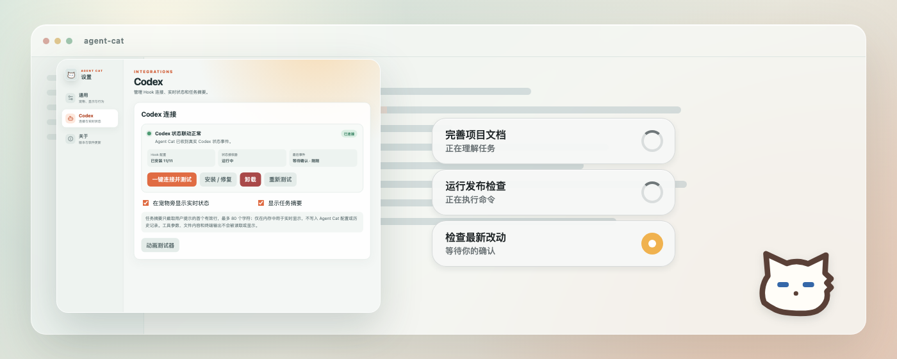

# Agent Cat

<p align="center">
  
</p>

<p align="center">
  <strong>An animated desktop companion for AI agents.</strong>
</p>

<p align="center">
  English · <a href="README.zh-CN.md">简体中文</a>
</p>

Agent Cat brings AI agent activity to life through animated desktop pets and real-time status updates. It is designed as an agent- and platform-independent companion, with Codex, Claude Code, and DeepSeek Harness integrations on macOS and Windows.

<p align="center">
  <a href="docs/images/agent-cat-overview.png">
    
  </a>
</p>

> **Current status:** Agent Cat is under active development. The current version supports macOS 12 or later and Windows 10 or later, and integrates with Codex, Claude Code, and DeepSeek Harness. Support for more agents and operating systems is planned.

## Download

Download the latest build from [GitHub Releases](https://github.com/LRainner/AgentCat/releases/latest).

The current macOS build is not notarized with an Apple Developer ID. If macOS blocks the first launch, right-click Agent Cat and choose **Open**, or allow it from **System Settings → Privacy & Security**. Only install builds downloaded from this repository.

The current Windows build is not code-signed. Windows SmartScreen may show a warning on first launch; only continue when the installer was downloaded from this repository.

## Highlights

- Animated desktop pets with click, double-click, drag, idle, and pointer-following reactions
- Real-time agent state displayed beside the pet without expanding its clickable area
- Configurable size, opacity, always-on-top behavior, mouse passthrough, and position locking
- System tray controls, launch at login, a settings window, and an animation debugger
- Codex-compatible v1 and v2 pet packs, including all nine standard animations and 16 v2 look directions
- Pet discovery from installed ChatGPT/Codex apps, `~/.codex/pets`, and user-selected directories
- On-demand access to locally installed pet assets without copying or redistributing them
- A built-in original fallback pet when no compatible pet pack is available

## Agent integrations

### Codex

Agent Cat can react to Codex sessions through command hooks. The settings window can install, repair, test, and remove the integration while preserving hooks owned by other tools.

The integration currently recognizes session start/end, prompt, tool, subagent, compaction, permission, completion, and interrupted-turn events. Live status and task summaries can be enabled independently.

### Claude Code

Agent Cat installs command hooks into `~/.claude/settings.json` without replacing existing Claude Code settings or hooks. It observes 13 state-relevant events covering sessions, prompts, tools and tool failures, subagents, compaction, permission requests, turn completion and API failures. The integration can be installed, tested, paused, repaired, and removed independently from Codex.

### DeepSeek Harness

Agent Cat reacts to DeepSeek Harness through the bundled [`dsh-session-agent-cat`](plugins/dsh-session-agent-cat/README.md) plugin (Settings → Agents → DeepSeek Harness → Connect). It forwards only sanitized lifecycle metadata locally — tool arguments, file contents, and terminal output never leave the harness process. Restart DeepSeek Harness after the first install or an update; see the [plugin README](plugins/dsh-session-agent-cat/README.md) for details.

## Pet packs

Each pet lives in its own directory and contains a `pet.json` manifest plus a PNG or WebP spritesheet:

```json
{
  "id": "my-pet",
  "displayName": "My Pet",
  "description": "An optional description",
  "spriteVersionNumber": 2,
  "spritesheetPath": "spritesheet.png"
}
```

The current renderer supports the Codex-compatible sprite layout:

- Cell size: `192 × 208`
- v1 sheet: `8 × 9` cells (`1536 × 1872`)
- v2 sheet: `8 × 11` cells (`1536 × 2288`)
- `spriteVersionNumber` may be `1` or `2`; omitting it selects v1

Place custom packs in `~/.codex/pets` or add another directory from Settings.

## Development

### Requirements

- macOS 12 or later, or Windows 10 or later
- Node.js 20.19 or later
- A stable Rust toolchain
- Xcode Command Line Tools on macOS
- Microsoft Edge WebView2 Runtime on Windows (the installer can download it when needed)

### Run locally

```bash
npm install
npm run tauri -- dev
```

Right-click the pet to open Settings. Auxiliary windows can also be opened from the command line:

```bash
agent-cat --settings
agent-cat --pet-debug
```

### Test and build

Install Playwright Chromium once before running the browser tests or regenerating screenshots:

```bash
npx playwright install chromium
```

```bash
npm test
npm run test:e2e
npm run screenshots
npm run build
cargo test --manifest-path src-tauri/Cargo.toml
npm run tauri -- build
```

`npm run screenshots` regenerates the deterministic product images in `docs/images` with mocked local data.

To build only the Windows NSIS installer, run `npm run build:windows` on Windows. On macOS, `npm run build:macos` builds the app bundle.

## Project structure

```text
assets/       Original application and menu bar artwork
docs/         Product screenshots generated for the README
plugins/      Agent integration plugins (e.g. dsh-session-agent-cat)
e2e/          Browser tests and the deterministic screenshot generator
fixtures/     Deterministic pet packs used by automated tests
src/          HTML, TypeScript, CSS, and frontend tests
src-tauri/    Rust backend, Tauri configuration, and platform icons
```

## Privacy

Agent Cat processes Codex, Claude Code, and DeepSeek Harness events locally. Its hook helper extracts lifecycle identifiers, the hook event name, and a sanitized tool name, sends them through a local Unix domain socket on macOS or a loopback-only TCP connection on Windows, and exits immediately. For Codex only, it also receives the active transcript path to detect Esc interruptions, reads only newly appended records while a task is active, and discards raw records after checking their lifecycle metadata. Claude Code transcripts are not observed, and the DeepSeek Harness plugin likewise forwards only sanitized lifecycle metadata.

When task summaries are enabled, Agent Cat keeps at most the first non-empty prompt line, truncated to 80 characters, in memory for live display. It does not store the summary in its configuration, logs, or history.

Agent Cat does not persist full prompts, tool arguments, file contents, transcripts, terminal output, token usage, or model information. It does not maintain an activity history or send this data to a remote service.

## Roadmap

- Additional AI agent adapters
- Linux support
- A documented, agent-neutral event adapter interface
- A standalone pet-pack specification and authoring workflow

Contributions and ideas are welcome while the project takes shape.
